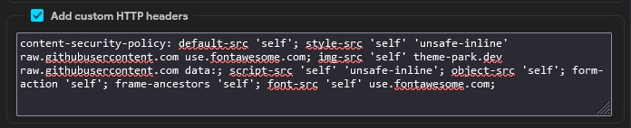

# qBittorrent Web UI theme - cjratliff.com [^1]
[^1]: Based on colorscheme from [cjratliff.com](https://cjratliff.com)


## Installation
First, you need to download a copy of the latest release (or clone / download this repository for the latest).

- [ ] Under Tools->Preferences->WebUI enable Use alternative WebUI.
- [ ] Choose a location that points to `/path/to/qbittorrent-webui-cjratliff.com`
- [ ] Restart qBittorrent or refresh your browser for changes to take effect.
- [ ] *Optional* Add content-security-policy headers under Tools->Preferences->WebUI > Add custom HTTP headers

`content-security-policy: default-src 'self'; style-src 'self' 'unsafe-inline' raw.githubusercontent.com use.fontawesome.com; img-src 'self' theme-park.dev raw.githubusercontent.com data:; script-src 'self' 'unsafe-inline'; object-src 'self'; form-action 'self'; frame-ancestors 'self'; font-src 'self' use.fontawesome.com;`




You can also change these settings via the config file. The relevant entries are:

```
WebUI\AlternativeUIEnabled=true
WebUI\RootFolder=/path/to/qbittorrent-webui-cjratliff.com
```

## Styling
### Colors
-  `Primary: #00d9ff`
-  `Background: #202020`
-  `Background-Alt: #242424`
-  `Background-Alt2: #4e4e4e`
-  `Text: #c2c2c2`
-  `Text-Alt: #d3d3d3`
-  `Line-Color: #2F3437`
-  `Red: #ef596f`
-  `Orange: #be5046`
-  `Yellow: #e5c07b`
-  `Green: #89ca78`
-  `Blue: #61afef`
-  `Indigo: #d55fde`
-  `Violet: #ba5fde`

### Fonts
    Google Sans


## Other
*This is for qBittorent versions 5.x and higher, or qBittorent < 5.x, please use [v1.4.0](https://github.com/Carve/qbittorrent-webui-cjratliff.com/releases/tag/v1.4.0)*
